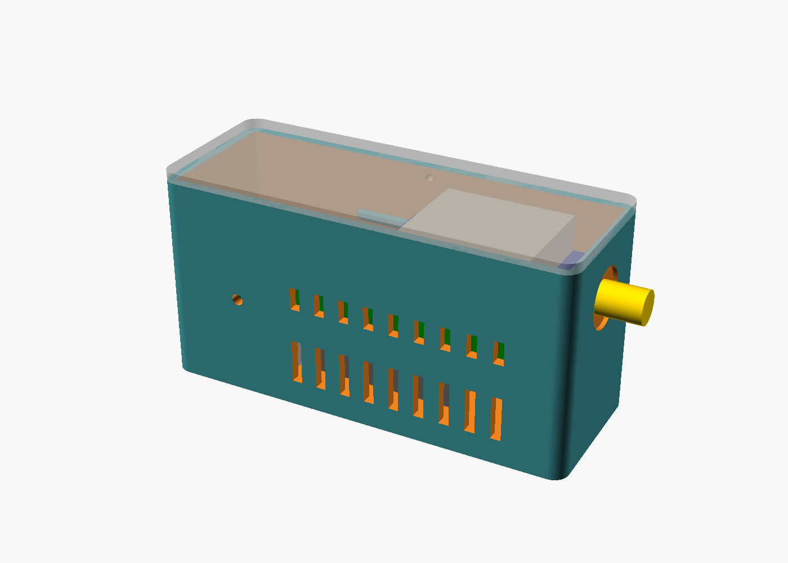

# Case: ESP32-S3-ETH + SMA GPS board

`gps-ntp-case.scad` is a parametric OpenSCAD case for a Waveshare ESP32-S3-ETH (with its PoE module) and a NEO-6M/7M-style GPS board that has an edge-mount SMA jack. Ethernet and USB-C leave one end and the antenna leaves the other.



> **Status: rendered, not yet printed.** The ESP32-S3-ETH dimensions come from Waveshare's drawing. The GPS board dimensions are guesses for a 39 × 25.5 mm clone board. Measure yours and set the `[GPS board - MEASURE]` values in the Customizer before printing.

## Rendering

```bash
openscad -D 'part="base"' -o base.stl gps-ntp-case.scad
openscad -D 'part="lid"'  -o lid.stl  gps-ntp-case.scad
```

`part` can also be `both`, `assembly` (with mock boards) or `section` (a cut-away for checking clearances).

## Printing

- Print the base upright and the lid as exported (already flipped). Neither needs supports: the GPS rails are chamfered underneath and the slots bridge.
- PETG is a better choice than PLA, because the PoE module runs warm.
- Hardware: two M2 × 6 self-tapping screws, and the SMA jack's own washer and nut.
